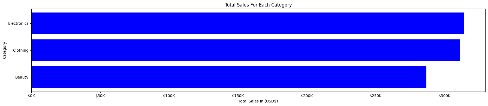
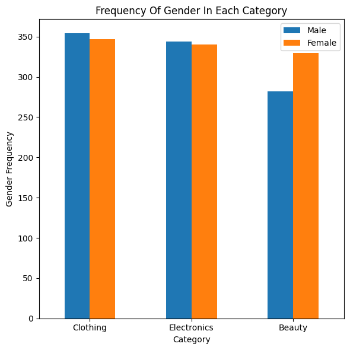
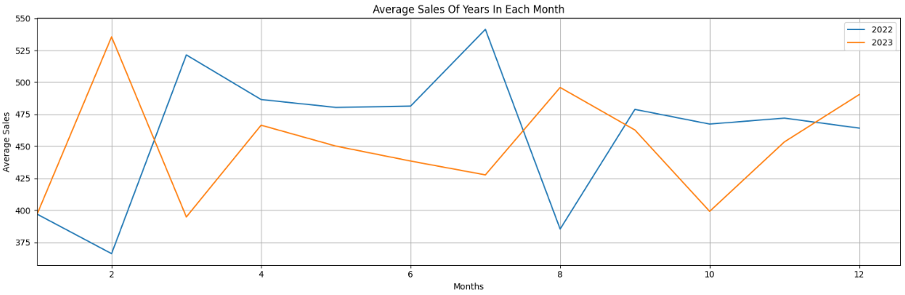
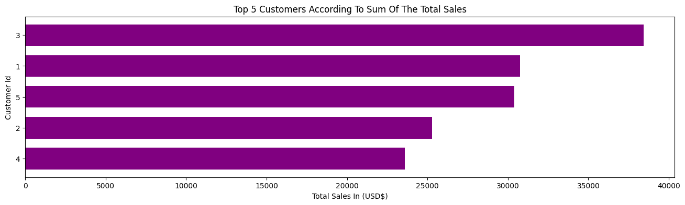
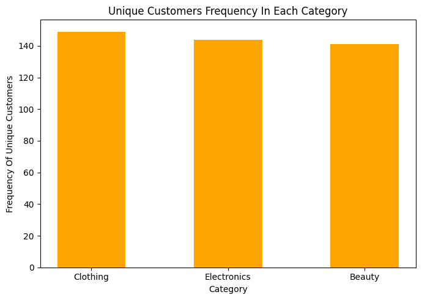

# **Retail Sales Analysis Project**
# **1. Introduction**:
This project delves into the analysis of a comprehensive retail sales dataset, aiming to uncover valuable insights and trends that drive business decisions. The process begins with a thorough data cleaning phase to ensure the accuracy and reliability of the dataset. Following this, we explore the relationships and patterns between various columns, such as sales performance, customer demographics, and product categories. By addressing key business challenges and extracting actionable insights.

You can see all SQL queries for the project here: [SQL_Queries](SQL_Queries), and all Python visualizations for the project here: [Python_Visualization](Python_Visualization).

---

# 2. Tools I Used:
To thoroughly explore the retail sales dataset, I utilized the capabilities of a range of essential tools:

1. **SQL:** allowing me to query the database and explore critical insights.

2. **PostgreSQL:** relational database management system **RDBMS**.

3. **Visual Studio Code:** for ****Python** coding for analysis and visualize the charts of business insights through Python libraries such as **Pandas** and **Matplotlib**.

4. **Jupyter Notebook:** as it an interactive web-based environment that allows users to create and share documents containing live code, visualizations, and narrative text, using Python language.

5. **Git & GitHub:** for sharing my SQL scripts and analysis.
---

# 3. **Objectives**:

1. **Database Setup:** create a retail sales database and create a retail_sales_fact table, which contain all transactions of the dataset on it, then upload the dataset from CSV file to the retail sales database through PostgreSQL RDBMS.

2. **Data Inspection:** describe structue of a table, and make sure that the database number of rows is same CSV file.

3. **Data Cleaning:** clean the database through dealing with the null values in differeny columns.

4. **Exploratory Data Analysis (EDA):** basic exploratory data analysis to understand the dataset.

5. **Business Analysis & Python Visualizations:** use SQL for the analysis to provide a deeper understanding of the retail sales database, enabling data-driven strategies to optimize sales, enhance customer satisfaction, and improve overall business performance.

6. **Findings & Insights**: addressing key business challenges and extracting actionable insight.


## **3.1. Database Setup:**
- **Database Creation:** create a retail_sales database.
- **Table Creation:** create a retail_sales_fact table, which contain all transactions of the dataset on it.

```sql
-- Create Retail "Sales Database":
CREATE DATABASE retail_sales;

-- Create Table "retail_sales_fact"':
DROP TABLE IF EXISTS retail_sales_fact;
CREATE TABLE retail_sales_fact (
	transactions_id INT NOT NULL PRIMARY KEY,
	sale_date DATE,
	sale_time TIME,
	customer_id INT,
	gender VARCHAR(20) NOT NULL,	
	age INT,	
	category VARCHAR(25),	
	quantiy	INT,
	price_per_unit DECIMAL(10,2),
	cogs DECIMAL(10,2),
	total_sale DECIMAL(10,2)
);
```
**Then upload the dataset from CSV file to the retail sales database through PostgreSQL RDBMS.**

## **3.2. Data Inspection:** 
- Describe structue of a table.
- Make sure that the database number of rows is same CSV file.
```sql
-- Describe Structue Of A Table:
SELECT
	COLUMN_NAME,
	DATA_TYPE
FROM
	INFORMATION_SCHEMA.COLUMNS
WHERE
	TABLE_NAME = 'retail_sales_fact';

-- Upload The Data Into the Database From the CSV File Using Import / Export Data To PostgreSQL:
SELECT * FROM retail_sales_fact;

-- Make Sure That The Database Number Of Rows Is Same CSV File:
SELECT COUNT(*) FROM retail_sales_fact; -- 2000
```
## **3.3. Data Cleaning:**

**1. Find Null Values In Each Column:**

```sql
SELECT * 
FROM retail_sales_fact
WHERE transactions_id IS NULL;
-- 0 Rows Affected (No Null Values In "transactions_id")

SELECT * 
FROM retail_sales_fact
WHERE sale_date IS NULL;
-- 0 Rows Affected (No Null Values In "sale_date")

SELECT * 
FROM retail_sales_fact
WHERE sale_time IS NULL;
-- 0 Rows Affected (No Null Values In "sale_time")

SELECT * 
FROM retail_sales_fact
WHERE customer_id IS NULL;
-- 0 Rows Affected (No Null Values In "customer_id")

SELECT * 
FROM retail_sales_fact
WHERE gender IS NULL;
-- 0 Rows Affected (No Null Values In "gender")

SELECT * 
FROM retail_sales_fact
WHERE age IS NULL;
-- 10 Rows Affected (10 Null Rows In "gender")

SELECT * 
FROM retail_sales_fact
WHERE quantiy IS NULL;
-- 3 Rows Affected (10 Null Rows In "quantiy")

SELECT * 
FROM retail_sales_fact
WHERE price_per_unit IS NULL;
-- 3 Rows Affected (10 Null Rows In "price_per_unit")

SELECT * 
FROM retail_sales_fact
WHERE cogs IS NULL;
-- 3 Rows Affected (10 Null Rows In "cogs")

SELECT * 
FROM retail_sales_fact
WHERE total_sale IS NULL;
-- 3 Rows Affected (10 Null Rows In "total_sale")
```
```sql
-- OR
SELECT *
FROM
	retail_sales_fact
WHERE
	transactions_id IS NULL
	OR
	sale_date IS NULL
	OR
	sale_time IS NULL
	OR
	customer_id IS NULL
	OR
	gender IS NULL
	OR
	age IS NULL
	OR
	category IS NULL
	OR
	quantiy IS NULL
	OR
	price_per_unit IS NULL
	OR
	cogs IS NULL
	OR
	total_sale IS NULL;
```
**2. Drop All Null Rows (age, quantiy, price_per_unit, cogs, total_sale) Columns:** as this columns vales can not replaced with expected values (mean, median, mode).

```sql
DELETE FROM retail_sales_fact
WHERE 
	quantiy IS NULL
	OR
	price_per_unit IS NULL
	OR
	cogs IS NULL
	OR
	total_sale IS NULL;
```
**3. Treat With Null Values In Column "age":**
- Choose The Suitable Value To Replace Null Values In Column "age" With It.

- We Will Compare Between The Values Of **Mean**, **Median**, **Mode** Of "age" Column And Find Suitable One To Replace Null Values With It.

**(1) Mean Of Column "age":**
```sql
SELECT
	ROUND(AVG(age),0)
FROM
	retail_sales_fact
WHERE
	age IS NOT NULL; 
-- "41" Is The Average Age Value In The Whole Database.
```
**(2) Median Of Column "age":**
```sql
-- First, Check If Count(age) Is Odd Or Even Number:

SELECT
	COUNT(age),
	CASE
		WHEN (COUNT(age) % 2) = 0 THEN 'Even Number'
		WHEN (COUNT(age) % 2) != 0 THEN 'Odd Number'
	END AS count_type
FROM
	retail_sales_fact;
-- 1987	"Odd Number"

-- In This Case, When Count(age) Is Odd Number, Then Median Equal The Middle Value In An Ordered Dataset:

WITH ranked_cte AS (
	SELECT
		age,
		ROW_NUMBER() OVER(ORDER BY age ASC) AS age_rank,
		COUNT(age) OVER() age_count
	FROM
		retail_sales_fact
)
SELECT
	age AS median_age
FROM
	ranked_cte
WHERE
	age_rank = ((age_count + 1) / 2); -- AS Count(age) Is Odd Number
-- 
-- "42" Is The Median Age Value In The Whole Database.
```
**(3) Mode Of Column "age":**
```sql
WITH age_grouping AS (
	SELECT
		age,
		COUNT(age) age_count
	FROM
		retail_sales_fact
	GROUP BY
		age
	ORDER BY
		COUNT(age) DESC,
		age ASC
)
SELECT
	age
FROM
	age_grouping
WHERE
	age_count = (SELECT age_count FROM age_grouping LIMIT 1); -- 43 - 64
-- "43" & "64" Are The Mode Age Value In The Whole Database.
```
**The Best Choice Is Replace NULL with the median (42), As:**
1. The median is robust to outliers and closely represents the central tendency of the data.
2. It is a simple and effective method for most datasets.

```sql
UPDATE retail_sales_fact
SET age = 42
WHERE age IS NULL;

SELECT * FROM retail_sales_fact WHERE age IS NULL; -- 0 Rows Affected
```
4. **Rename Column 'quantiy' To 'quantity':**

```sql
ALTER TABLE retail_sales_fact
RENAME COLUMN quantiy to quantity;
```
## **3.4. Exploratory Data Analysis (EDA):**

**(1) How Many Invoices Data Have:**
```sql
SELECT COUNT(*) FROM retail_sales_fact; -- 1997
```
**(2) How Many Unique Customers Data Have:**
```sql
SELECT COUNT(DISTINCT customer_id) FROM retail_sales_fact; -- 155
```
**(3) How Many Unique Categories We Have:**
```sql
SELECT COUNT(DISTINCT category) FROM retail_sales_fact; -- 3
```
**(4) Highest Category Mentioned In The Invoices:**
```sql
SELECT
	DISTINCT category,
	COUNT(category) OVER(PARTITION BY category) AS category_count
FROM
	retail_sales_fact
ORDER BY
	category_count DESC;
	
-- Clothing 701
-- Electronics 684
-- Beauty 612
```
```sql
-- OR
SELECT
	DISTINCT category,
	COUNT(category) AS category_count
FROM
	retail_sales_fact
GROUP BY
	category
ORDER BY 
	category_count DESC;
```
**(5) Highest Gender Mentioned In The Invoices:**
```sql
SELECT
	DISTINCT gender,
	COUNT(gender) AS gender_count
FROM
	retail_sales_fact
GROUP BY
	gender
ORDER BY 
	gender_count DESC;

-- Female 1017
-- Male 980
```
## **3.5. Business Analysis & Python Visualizations:** 

### **My Analysis & Findings:**

**(1) Write a SQL query to retrieve all columns for sales made on '2022-11-05':**
```sql
SELECT * FROM retail_sales_fact WHERE sale_date = '2022-11-05'; -- 11 Rows Affected
```
**(2) Write a SQL query to retrieve all transactions where the category is'Clothing' and the quantity sold is more than 4 in the month of Nov-2022:**
```sql
SELECT 
	*
FROM
	retail_sales_fact
WHERE
	category = 'Clothing'
	AND
	quantity >= 4
	AND
	SUBSTRING((sale_date::VARCHAR(20)),1,7) = '2022-11'; -- 17 Rows Affected
```
```sql
-- OR:
SELECT 
	*
FROM
	retail_sales_fact
WHERE
	category = 'Clothing'
	AND
	quantity >= 4
	AND 
	TO_CHAR(sale_date, 'YYYY-MM') = '2022-11'; -- 17 Rows Affected
```
```sql
-- OR
SELECT 
	*
FROM
	retail_sales_fact
WHERE
	category = 'Clothing'
	AND
	quantity >= 4
	AND
	EXTRACT(MONTH FROM sale_date) = 11
	AND
	EXTRACT(YEAR FROM sale_date) = 2022; -- 17 Rows Affected
```

**(3) Write a SQL query to calculate the total sales (total_sale) for each category:**

```sql
SELECT 
	category,
	ROUND(SUM(total_sale), 0) AS net_sale 
FROM
	retail_sales_fact
GROUP BY
	category
ORDER BY
	net_sale DESC;
```
**Python Visualization:**
```py
plt.figure(figsize=(18,4))
plt.barh(df["category"], df["net_sale"], color='blue')
plt.title("Total Sales For Each Category")
plt.ylabel("Category")
plt.xlabel("Total Sales In (USD$)")
plt.gca().xaxis.set_major_formatter(plt.FuncFormatter(lambda x, position: f"${int(x / 1000)}K"))
plt.gca().invert_yaxis()
plt.tight_layout()
```

---

**(4) Write a SQL query to find the average age of customers who purchased items from the 'Beauty' category:**
```sql
SELECT
	ROUND(AVG(age), 2)
FROM 
	retail_sales_fact
WHERE
	category = 'Beauty'; -- 40.42
```
**(5) Write a SQL query to find all transactions where the total_sale is greater than 1000:**
```sql
SELECT * FROM retail_sales_fact WHERE total_sale > 1000; -- 306 Rows Affected
```
**(6) Write a SQL query to find the total number of transactions (transaction_id) made by each gender in each category:**
```sql
-- 1. Using Window Functions:
SELECT 
	DISTINCT category,
	gender,
	COUNT(transactions_id) OVER(PARTITION BY category, gender)
FROM
	retail_sales_fact
ORDER BY
	category ASC;
```
```sql
-- 2. Using Group By:
SELECT
	category,
	gender,
	COUNT(transactions_id)
FROM
	retail_sales_fact
GROUP BY
	category,
	gender
ORDER BY
	category ASC;
```
**Python Visualization:**
```py
# Create A Pivot Table For Frequency Of Gender In Each Category:
gender_category_pivot = df.pivot_table(
    index="category",
    columns="gender",
    values="count"
)

gender_category_pivot_copy = gender_category_pivot.copy()
gender_category_pivot_copy["total"] = (gender_category_pivot_copy["Female"] + gender_category_pivot_copy["Male"])

gender_category_pivot_copy.sort_values(by=["total"], ascending=False, inplace=True)
gender_category_pivot_copy.drop(columns="total", inplace=True)

# Resorting Gender In Pivot Table To Make Gender Nale Color Blue:
gender_category_pivot_copy = gender_category_pivot_copy[["Male", "Female"]]

gender_category_pivot_copy.plot(
    kind='bar',
    figsize=(6,6)
)
plt.title("Frequency Of Gender In Each Category")
plt.xlabel("Category")
plt.ylabel("Gender Frequency")
plt.legend(loc='best')
plt.xticks(rotation=0)
plt.tight_layout()
```

---

**(7) Write a SQL query to show the distribution of time series with sales in the dataset:**

```sql
SELECT
	EXTRACT(YEAR FROM sale_date) AS Year,
	EXTRACT(MONTH FROM sale_date) AS Month,
	ROUND(AVG(total_sale), 2) AS sales_average
FROM
	retail_sales_fact
GROUP BY
	Year,
	Month
ORDER BY
	Year ASC,
	Month ASC;
```
**Python Visualization:**
```py
# Create A Pivot Table To Compare Months Average Sales For Each Year:
year_month_pivot = df.pivot_table(
    columns="year",
    index="month",
    values="sales_average"
)

plt.figure(figsize=(15,5))
for column in year_month_pivot.columns:
    plt.plot(
        year_month_pivot.index,
        year_month_pivot[column],
        label=column
    )
plt.title("Average Sales Of Years In Each Month")
plt.xlabel("Months")
plt.ylabel("Average Sales")
plt.xlim(left=year_month_pivot.index.min())
plt.legend(loc='best')
plt.grid()
plt.tight_layout()
```

---

**(8) Write a SQL query to calculate the average sale for each month. Find out best selling month in each year:**
```sql
WITH year_sales_avg AS (
	SELECT
		EXTRACT(YEAR FROM sale_date) AS Year,
		EXTRACT(MONTH FROM sale_date) AS Month,
		ROUND(AVG(total_sale), 2) AS sales_average,
		RANK() OVER(PARTITION BY EXTRACT(YEAR FROM sale_date) ORDER BY ROUND(AVG(total_sale), 2) DESC) AS rank_avg
	FROM
		retail_sales_fact
	GROUP BY
		Year,
		Month
)
SELECT *
FROM
	year_sales_avg
WHERE
	rank_avg = 1;
```
**(9) Write a SQL query to find the top 5 customers based on the highest total sales:**
```sql
SELECT
	customer_id,
	SUM(total_sale) AS total_sales
FROM
	retail_sales_fact
GROUP BY
	customer_id
ORDER BY
	total_sales DESC
LIMIT
	5;
```
**Python Visualization:**
```py
df.set_index('customer_id', inplace=True)

df.plot(
   kind='barh',
   figsize=(16,4),
   color='purple',
   width=0.7,
   legend=False
)
plt.gca().invert_yaxis()
plt.title("Top 5 Customers According To Sum Of The Total Sales")
plt.xlabel("Total Sales In (USD$)")
plt.ylabel("Customer Id")
plt.tight_layout()
```

---

**(10) Write a SQL query to find the number of unique customers who purchased items from each category:**
```sql
SELECT
	category,
	COUNT(DISTINCT customer_id) AS uni_customer_count
FROM
	retail_sales_fact
GROUP BY
	category
ORDER BY
	uni_customer_count DESC;
```
**Python Visualization:**
```py
df.set_index('category', inplace=True)

plt.figure(figsize=(7,5))
plt.bar(
    df.index,
    df['uni_customer_count'],
    color='orange',
    width=0.5
    )
plt.title("Unique Customers Frequency In Each Category")
plt.xlabel("Category")
plt.ylabel("Frequency Of Unique Customers")
plt.tight_layout()
```

---

**(11) Write a SQL query to create each shift and number of orders (Example Morning <=12, Afternoon Between 12 & 17, Evening >17):**
```sql
WITH shift_time AS (
	SELECT
		*,
		CASE
			WHEN EXTRACT(HOUR FROM sale_time) < 12 THEN 'Morning'
			WHEN EXTRACT(HOUR FROM sale_time) BETWEEN 12 AND 17 THEN 'Afternoon'
			ELSE 'Evening'
		END AS shift_type,
		EXTRACT(HOUR FROM sale_time)
	FROM
		retail_sales_fact
)
SELECT
	shift_type,
	COUNT(transactions_id) AS order_count
FROM
	shift_time
GROUP BY
	shift_type
ORDER BY
	order_count DESC;
```
**Python Visualization:**
```py
plt.figure(figsize=(16,4))
plt.barh(
    df["shift_type"],
    df["order_count"],
    )
plt.gca().invert_yaxis()
plt.title("Relation Between Orders Count And Shift Time")
plt.xlabel("Orders Frequency")
plt.ylabel("Shift Type")
plt.tight_layout()
```

---

## **3.6 Findings & Insights:**

- **Electronics** leads in net sales at 313,810, indicating strong demand and potential for further growth in this category, **clothing** follows closely with 311,070, **beauty** ranks third with 286,840, showing steady performance but may need targeted promotions to close the gap with top categories.  

- **Clothing** has the highest transaction count (701 total), with nearly equal participation from both genders (Female: 347, Male: 354), indicating broad appeal. **Electronics** follows closely (684 total), with balanced gender participation (Female: 340, Male: 344), suggesting it’s a unisex category. **Beauty** has the lowest transaction count (612 total), with a stronger female customer base (Female: 330, Male: 282), highlighting a gender skew. 

- **Gender-neutral trends in Clothing and Electronics** suggest marketing strategies should target all customers, while Beauty may benefit from tailored campaigns to attract more **male** customers.

- **Comparing 2022 and 2023** monthly averages highlights whether the business is improving, stagnating, or declining, providing insights into the effectiveness of strategies implemented.  

- **The top-Performing months** are July 2022 (541.34) and February 2023 (535.53), which had the highest average sales in their respective years.  

- **These peaks** suggest potential seasonal trends or successful promotions during these periods.  

- **Leverage strategies** from these top months (e.g., marketing campaigns, discounts) to replicate success in other periods.

- **Top 5 customers by total sales** are customer 3 leads with 38,440, followed by Customers 1, 5, 2, and 4, highlighting key high-value clients to prioritize for retention and personalized engagement.

- **Evening** has the highest order count (1,062), followed by Morning (558) and Afternoon (377), indicating optimal staffing and marketing focus during evenings.

# 4. **Conclusion:**

- **Electronics and Clothing drive the highest revenue**, with balanced gender appeal, while Beauty lags slightly and may need targeted campaigns to attract more male customers. 

- **Seasonal peaks (July 2022, February 2023)** and evening shifts show optimal sales periods, suggesting focused marketing and staffing strategies during these times.  

- **High-value customers and consistent monthly trends** highlight opportunities for personalized retention efforts and strategic planning to replicate success across underperforming periods.

